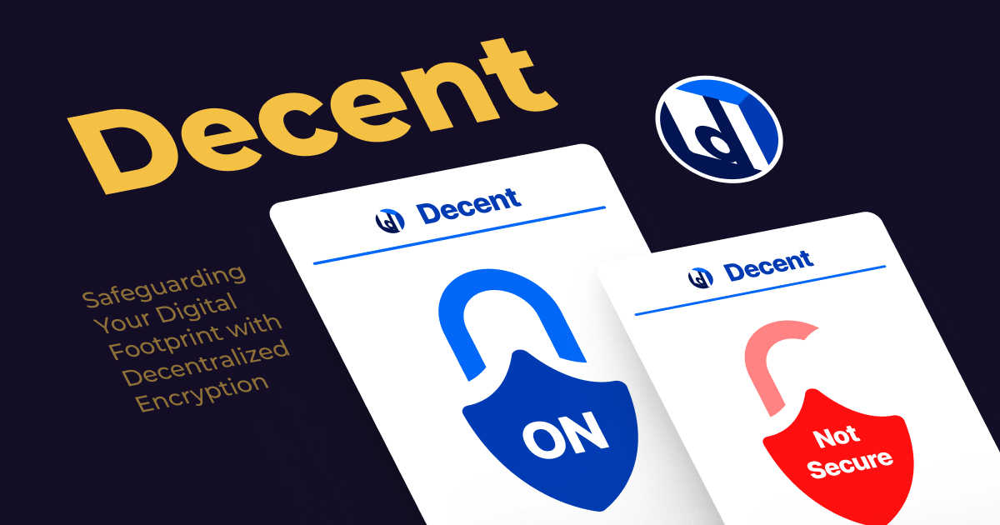

# Decent - Building Decentralized Personal Data

## Introduction
Decent is a browser extension aimed at revolutionizing the way we communicate online. In an era dominated by tech giants and growing concerns about data privacy, Decent offers a solution that empowers users with control over their encryption keys, ensuring enhanced privacy and security for their messages.

## Key Features
- **Decentralized Encryption**: Decent utilizes cutting-edge decentralized encryption protocols to ensure end-to-end encryption of your messages. Unlike traditional encryption methods employed by tech giants, Decent ensures that only you have access to your encryption keys, providing an extra level of security and privacy for your communication.
- **User-Friendly Interface**: We understand the importance of simplicity and ease of use. Decent features an intuitive interface that seamlessly integrates with popular messaging platforms, allowing you to encrypt and decrypt messages with just a few clicks.
- **Enhanced Privacy**: Your privacy is our top priority. With Decent, you can communicate with confidence, knowing that your messages are protected from unauthorized access and surveillance by centralized entities.

## How It Works
Decent adds an additional layer of protection to your messages by encrypting them before they are sent through messaging platforms. When you send a message using Decent, it is encrypted using decentralized encryption protocols, ensuring that only you and the intended recipient have access to the message content. This extra level of security and privacy ensures that your communication remains confidential and protected from prying eyes.

## Future Development
At Decent, we're committed to continuous improvement and innovation. We're constantly working on adding new features and enhancements to Decent to further enhance your privacy and security. Some of the features we're exploring include:
- Multi-platform support: Extending Decent's compatibility to other popular messaging platforms.
- Advanced encryption options: Offering users the ability to customize their encryption settings for added security.
- Integration with additional privacy tools: Partnering with other privacy-focused services to provide a comprehensive privacy solution.

Stay tuned for updates and new releases as we continue to evolve Decent to meet the ever-changing needs of our users!
